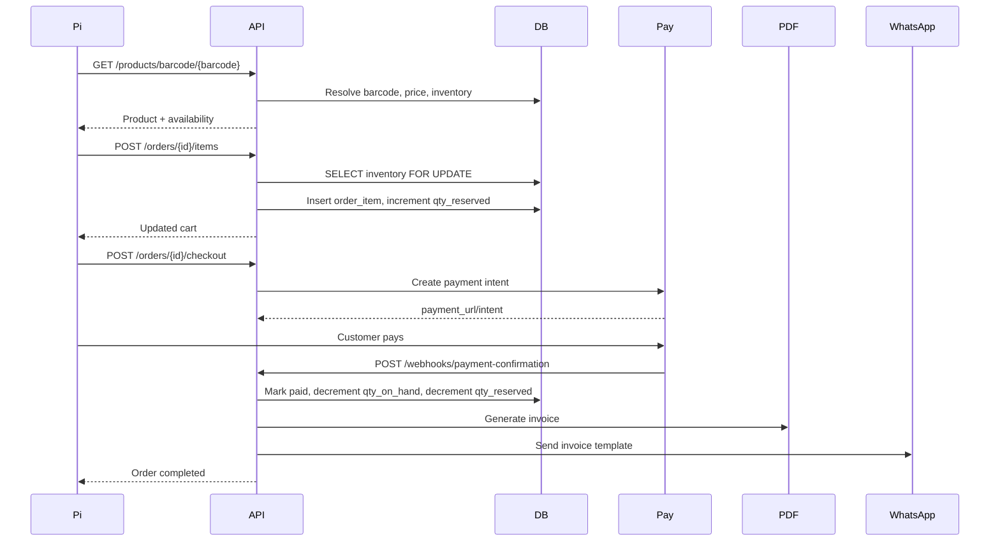

# Smart eKart Enterprise IoT Architecture

This document answers the 11 production architecture questions for a Raspberry Pi based Smart eKart system. It is a target architecture that extends the current prototype codebase. The checked-in backend currently contains `categories`, `products`, `product_barcodes`, `stores`, `inventory`, `customers`, `orders`, and `order_items`; it does not yet contain the full enterprise schema described here.

## Source Notes

The recommendations align with common IoT practice: device identity is cryptographic and independent of network identity; mTLS/X.509 is the device trust anchor; MQTT is preferred for device command/telemetry channels; PostgreSQL partitions high-volume append-heavy tables by time. Official references: AWS IoT X.509 device certificates, PostgreSQL declarative partitioning, PgBouncer connection pooling, OASIS MQTT, Expo web publishing, and Meta WhatsApp Cloud API/webhooks.

## 1. Device Identity

### Direct Recommendation

Use a generated immutable `device_id` plus an X.509 device certificate as the production identity. Store MAC address, CPU serial number, disk serial, and OS image ID only as observed hardware attributes for fraud detection and support, not as primary identity.

### Reasoning

Enterprise IoT and POS systems treat the physical unit as a provisioned asset. The backend trusts a certificate/private key pair issued during provisioning, not a client-submitted MAC address or IP address. MAC and CPU serial are useful signals, but they can change, be missing, be duplicated in virtualized environments, or be spoofed. A generated UUID survives NIC/router/network changes and can survive hardware changes if the secure identity bundle is intentionally migrated. A certificate gives the backend cryptographic proof that the caller holds the private key.

Recommended identity layers:

```text
device_id: stable UUID assigned by backend
device_cert: X.509 client certificate bound to device_id
private_key: stored on Pi with root-only permissions, ideally TPM/secure element later
hardware_fingerprint: hash of CPU serial, machine-id, MACs, disk serials
observed_network: IP, SSID, gateway, RSSI, public IP, user agent
```

### Failure Modes

| Approach | Good for | Failure modes |
| --- | --- | --- |
| MAC address | Network debugging | NIC swap changes it; Wi-Fi/Ethernet have different MACs; spoofable; randomization possible |
| CPU serial | Hardware signal | Board replacement changes it; not secret; can be unreadable or cloned in images |
| Generated UUID | Stable app identity | Can be copied if SD card is cloned; needs secure storage and activation |
| Device certificate | Strong authentication | Key theft compromises device; cert rotation/revocation must exist |
| Combination | Production-grade | More operational complexity, but best fraud detection and lifecycle handling |

### Hardware Replacement Behavior

- SD card replaced, same Pi: device generates new bootstrap identity unless the identity bundle was backed up/restored by admin tooling.
- NIC replaced: no reassignment; backend records new MAC as an observed attribute.
- Pi board replaced, same terminal: admin provisions a new `device_id` and assigns it to the same terminal. Historical orders remain tied to the old `device_id`.
- SD card cloned maliciously: certificate/key duplicate is detected by impossible concurrent heartbeats, changed fingerprint, or revoked cert.

### Pi Filesystem Storage

Use:

```text
/etc/smart-ekart/device.json
/etc/smart-ekart/certs/device.crt
/etc/smart-ekart/certs/device.key
/etc/smart-ekart/certs/ca.crt
```

Permissions:

```bash
sudo chown -R root:smartcart /etc/smart-ekart
sudo chmod 0750 /etc/smart-ekart
sudo chmod 0640 /etc/smart-ekart/device.json
sudo chmod 0640 /etc/smart-ekart/certs/device.crt
sudo chmod 0640 /etc/smart-ekart/certs/ca.crt
sudo chmod 0600 /etc/smart-ekart/certs/device.key
```

### First-Boot Fingerprint Script

```python
#!/usr/bin/env python3
import hashlib
import json
import os
import subprocess
import uuid
from pathlib import Path

BASE = Path("/etc/smart-ekart")
IDENTITY = BASE / "device.json"

def read(path: str) -> str:
    try:
        return Path(path).read_text().strip()
    except Exception:
        return ""

def cmd(args: list[str]) -> str:
    try:
        return subprocess.check_output(args, text=True, stderr=subprocess.DEVNULL).strip()
    except Exception:
        return ""

def macs() -> list[str]:
    out = []
    for iface in Path("/sys/class/net").glob("*"):
        if iface.name == "lo":
            continue
        mac = read(str(iface / "address"))
        if mac:
            out.append(f"{iface.name}:{mac.lower()}")
    return sorted(out)

def cpu_serial() -> str:
    for line in read("/proc/cpuinfo").splitlines():
        if line.lower().startswith("serial"):
            return line.split(":", 1)[1].strip()
    return ""

def fingerprint() -> str:
    payload = {
        "cpu_serial": cpu_serial(),
        "machine_id": read("/etc/machine-id"),
        "macs": macs(),
        "disk_serial": cmd(["lsblk", "-ndo", "SERIAL", "/dev/mmcblk0"]),
    }
    raw = json.dumps(payload, sort_keys=True).encode()
    return hashlib.sha256(raw).hexdigest()

def main() -> None:
    if IDENTITY.exists():
        print(IDENTITY.read_text())
        return

    BASE.mkdir(mode=0o750, parents=True, exist_ok=True)
    device_uuid = str(uuid.uuid4())
    data = {
        "local_install_id": device_uuid,
        "hardware_fingerprint": fingerprint(),
        "provisioning_state": "UNREGISTERED",
        "identity_version": 1,
    }
    tmp = IDENTITY.with_suffix(".tmp")
    tmp.write_text(json.dumps(data, indent=2) + "\n")
    os.chmod(tmp, 0o640)
    tmp.replace(IDENTITY)
    print(json.dumps(data, indent=2))

if __name__ == "__main__":
    main()
```

### What Not To Do

Do not use IP address, Wi-Fi SSID, display ID, MAC address, or terminal ID as physical device identity. Those are mutable context, not identity.

## 2. Production PostgreSQL Schema

### Direct Recommendation

Use `Brand -> Store -> Terminal` as logical hierarchy, `Device` as a physical asset, and `device_terminal_assignments` as a temporal mapping. Orders must snapshot `brand_id`, `store_id`, `terminal_id`, and `device_id` at creation time.

### Core Types

```sql
CREATE EXTENSION IF NOT EXISTS pgcrypto;

CREATE TYPE device_status AS ENUM ('UNREGISTERED','ACTIVE','SUSPENDED','REVOKED','RETIRED');
CREATE TYPE assignment_status AS ENUM ('PENDING','ACTIVE','ENDED','REVOKED');
CREATE TYPE terminal_status AS ENUM ('ACTIVE','INACTIVE','MAINTENANCE','RETIRED');
CREATE TYPE order_status AS ENUM ('DRAFT','RESERVED','PAYMENT_PENDING','PAID','COMPLETED','CANCELLED','EXPIRED','REFUNDED');
CREATE TYPE payment_status AS ENUM ('NOT_STARTED','PENDING','AUTHORIZED','CAPTURED','FAILED','REFUNDED','PARTIALLY_REFUNDED');
CREATE TYPE whatsapp_status AS ENUM ('QUEUED','SENT','DELIVERED','READ','FAILED');
```

### Tenancy and Store Model

```sql
CREATE TABLE brands (
  brand_id uuid PRIMARY KEY DEFAULT gen_random_uuid(),
  code text NOT NULL UNIQUE,
  name text NOT NULL,
  legal_name text,
  gstin text,
  is_active boolean NOT NULL DEFAULT true,
  created_at timestamptz NOT NULL DEFAULT now(),
  updated_at timestamptz NOT NULL DEFAULT now(),
  deleted_at timestamptz
);

CREATE TABLE stores (
  store_id uuid PRIMARY KEY DEFAULT gen_random_uuid(),
  brand_id uuid NOT NULL REFERENCES brands(brand_id) ON DELETE RESTRICT,
  code text NOT NULL,
  name text NOT NULL,
  gstin text,
  address jsonb NOT NULL DEFAULT '{}'::jsonb,
  timezone text NOT NULL DEFAULT 'Asia/Kolkata',
  is_active boolean NOT NULL DEFAULT true,
  created_at timestamptz NOT NULL DEFAULT now(),
  updated_at timestamptz NOT NULL DEFAULT now(),
  deleted_at timestamptz,
  UNIQUE (brand_id, code)
);

CREATE INDEX stores_brand_active_idx ON stores(brand_id) WHERE deleted_at IS NULL AND is_active;
```

### Devices, Terminals, and Assignment History

```sql
CREATE TABLE terminals (
  terminal_id uuid PRIMARY KEY DEFAULT gen_random_uuid(),
  brand_id uuid NOT NULL REFERENCES brands(brand_id) ON DELETE RESTRICT,
  store_id uuid NOT NULL REFERENCES stores(store_id) ON DELETE RESTRICT,
  code text NOT NULL,
  label text,
  status terminal_status NOT NULL DEFAULT 'ACTIVE',
  config jsonb NOT NULL DEFAULT '{}'::jsonb,
  created_at timestamptz NOT NULL DEFAULT now(),
  updated_at timestamptz NOT NULL DEFAULT now(),
  deleted_at timestamptz,
  UNIQUE (store_id, code)
);

CREATE TABLE devices (
  device_id uuid PRIMARY KEY DEFAULT gen_random_uuid(),
  serial_number text UNIQUE,
  local_install_id uuid,
  hardware_fingerprint text,
  certificate_subject text UNIQUE,
  certificate_fingerprint_sha256 text UNIQUE,
  public_key_fingerprint_sha256 text UNIQUE,
  status device_status NOT NULL DEFAULT 'UNREGISTERED',
  model text NOT NULL DEFAULT 'Raspberry Pi 4 Model B',
  os_version text,
  app_version text,
  last_seen_at timestamptz,
  first_registered_at timestamptz NOT NULL DEFAULT now(),
  revoked_at timestamptz,
  revoke_reason text,
  metadata jsonb NOT NULL DEFAULT '{}'::jsonb
);

CREATE TABLE device_terminal_assignments (
  assignment_id uuid PRIMARY KEY DEFAULT gen_random_uuid(),
  device_id uuid NOT NULL REFERENCES devices(device_id) ON DELETE RESTRICT,
  terminal_id uuid NOT NULL REFERENCES terminals(terminal_id) ON DELETE RESTRICT,
  brand_id uuid NOT NULL REFERENCES brands(brand_id) ON DELETE RESTRICT,
  store_id uuid NOT NULL REFERENCES stores(store_id) ON DELETE RESTRICT,
  status assignment_status NOT NULL DEFAULT 'ACTIVE',
  assigned_by uuid,
  assigned_at timestamptz NOT NULL DEFAULT now(),
  effective_from timestamptz NOT NULL DEFAULT now(),
  effective_to timestamptz,
  ended_by uuid,
  ended_at timestamptz,
  reason text,
  CHECK (effective_to IS NULL OR effective_to > effective_from)
);

CREATE UNIQUE INDEX one_active_assignment_per_device_idx
  ON device_terminal_assignments(device_id)
  WHERE effective_to IS NULL AND status = 'ACTIVE';

CREATE UNIQUE INDEX one_active_device_per_terminal_idx
  ON device_terminal_assignments(terminal_id)
  WHERE effective_to IS NULL AND status = 'ACTIVE';

CREATE INDEX dta_terminal_time_idx ON device_terminal_assignments(terminal_id, effective_from DESC);
CREATE INDEX dta_store_time_idx ON device_terminal_assignments(store_id, effective_from DESC);
```

Why duplicate `brand_id` and `store_id` in assignments? It gives fast historical queries and prevents joins from depending on a terminal that may later move. Enforce consistency in service code or with triggers.

### Customers

```sql
CREATE TABLE customers (
  customer_id uuid PRIMARY KEY DEFAULT gen_random_uuid(),
  brand_id uuid NOT NULL REFERENCES brands(brand_id) ON DELETE RESTRICT,
  phone_e164 text NOT NULL,
  name text,
  email text,
  whatsapp_opt_in boolean NOT NULL DEFAULT false,
  whatsapp_opt_in_at timestamptz,
  loyalty_points integer NOT NULL DEFAULT 0,
  tier text NOT NULL DEFAULT 'STANDARD',
  is_active boolean NOT NULL DEFAULT true,
  created_at timestamptz NOT NULL DEFAULT now(),
  updated_at timestamptz NOT NULL DEFAULT now(),
  deleted_at timestamptz,
  UNIQUE (brand_id, phone_e164)
);
```

### Orders and Order Items

```sql
CREATE TABLE orders (
  order_id uuid NOT NULL DEFAULT gen_random_uuid(),
  brand_id uuid NOT NULL REFERENCES brands(brand_id) ON DELETE RESTRICT,
  store_id uuid NOT NULL REFERENCES stores(store_id) ON DELETE RESTRICT,
  terminal_id uuid NOT NULL REFERENCES terminals(terminal_id) ON DELETE RESTRICT,
  device_id uuid NOT NULL REFERENCES devices(device_id) ON DELETE RESTRICT,
  customer_id uuid REFERENCES customers(customer_id) ON DELETE SET NULL,
  order_number text NOT NULL,
  idempotency_key text NOT NULL,
  status order_status NOT NULL DEFAULT 'DRAFT',
  payment_status payment_status NOT NULL DEFAULT 'NOT_STARTED',
  subtotal numeric(12,2) NOT NULL DEFAULT 0,
  discount_total numeric(12,2) NOT NULL DEFAULT 0,
  cgst_total numeric(12,2) NOT NULL DEFAULT 0,
  sgst_total numeric(12,2) NOT NULL DEFAULT 0,
  round_off numeric(12,2) NOT NULL DEFAULT 0,
  grand_total numeric(12,2) NOT NULL DEFAULT 0,
  currency char(3) NOT NULL DEFAULT 'INR',
  invoice_number text,
  invoice_pdf_url text,
  ordered_at timestamptz NOT NULL DEFAULT now(),
  completed_at timestamptz,
  cancelled_at timestamptz,
  created_at timestamptz NOT NULL DEFAULT now(),
  updated_at timestamptz NOT NULL DEFAULT now(),
  PRIMARY KEY (order_id, ordered_at),
  UNIQUE (brand_id, order_number, ordered_at),
  UNIQUE (device_id, idempotency_key, ordered_at)
) PARTITION BY RANGE (ordered_at);

CREATE TABLE order_items (
  item_id uuid NOT NULL DEFAULT gen_random_uuid(),
  order_id uuid NOT NULL,
  ordered_at timestamptz NOT NULL,
  product_id uuid NOT NULL,
  barcode_value text,
  product_name text NOT NULL,
  sku text NOT NULL,
  hsn_code text,
  quantity integer NOT NULL CHECK (quantity > 0),
  unit_price numeric(10,2) NOT NULL,
  mrp numeric(10,2) NOT NULL,
  discount_amount numeric(10,2) NOT NULL DEFAULT 0,
  cgst_rate numeric(5,2) NOT NULL DEFAULT 0,
  cgst_amount numeric(10,2) NOT NULL DEFAULT 0,
  sgst_rate numeric(5,2) NOT NULL DEFAULT 0,
  sgst_amount numeric(10,2) NOT NULL DEFAULT 0,
  line_total numeric(12,2) NOT NULL,
  created_at timestamptz NOT NULL DEFAULT now(),
  PRIMARY KEY (item_id, ordered_at),
  FOREIGN KEY (order_id, ordered_at) REFERENCES orders(order_id, ordered_at) ON DELETE CASCADE
) PARTITION BY RANGE (ordered_at);
```

Price is stored on `order_items` because orders are legal/audit records. Product MRP, tax rates, names, and SKU can change later; historical receipts must not.

### Heartbeats, WhatsApp, and Audit

```sql
CREATE TABLE device_heartbeats (
  heartbeat_id bigserial,
  device_id uuid NOT NULL REFERENCES devices(device_id) ON DELETE CASCADE,
  terminal_id uuid,
  store_id uuid,
  seen_at timestamptz NOT NULL DEFAULT now(),
  app_version text,
  os_version text,
  cpu_temp_c numeric(5,2),
  ram_used_mb integer,
  disk_free_mb integer,
  wifi_rssi_dbm integer,
  local_ip inet,
  public_ip inet,
  ssid text,
  gateway_ip inet,
  network_type text,
  battery_percent numeric(5,2),
  status jsonb NOT NULL DEFAULT '{}'::jsonb,
  PRIMARY KEY (heartbeat_id, seen_at)
) PARTITION BY RANGE (seen_at);

CREATE TABLE whatsapp_messages (
  message_id uuid PRIMARY KEY DEFAULT gen_random_uuid(),
  brand_id uuid NOT NULL REFERENCES brands(brand_id) ON DELETE RESTRICT,
  order_id uuid,
  customer_id uuid REFERENCES customers(customer_id) ON DELETE SET NULL,
  phone_e164 text NOT NULL,
  template_name text NOT NULL,
  provider_message_id text UNIQUE,
  status whatsapp_status NOT NULL DEFAULT 'QUEUED',
  payload jsonb NOT NULL,
  error jsonb,
  queued_at timestamptz NOT NULL DEFAULT now(),
  sent_at timestamptz,
  delivered_at timestamptz,
  read_at timestamptz,
  failed_at timestamptz
);

CREATE TABLE audit_logs (
  audit_id uuid NOT NULL DEFAULT gen_random_uuid(),
  occurred_at timestamptz NOT NULL DEFAULT now(),
  brand_id uuid,
  store_id uuid,
  actor_type text NOT NULL CHECK (actor_type IN ('ADMIN','DEVICE','SYSTEM','WEBHOOK')),
  actor_id uuid,
  event_type text NOT NULL,
  entity_type text NOT NULL,
  entity_id uuid,
  request_id text,
  idempotency_key text,
  source_ip inet,
  user_agent text,
  before_state jsonb,
  after_state jsonb,
  diff jsonb,
  metadata jsonb NOT NULL DEFAULT '{}'::jsonb,
  prev_hash text,
  row_hash text NOT NULL,
  PRIMARY KEY (audit_id, occurred_at)
) PARTITION BY RANGE (occurred_at);

CREATE INDEX audit_entity_time_idx ON audit_logs(entity_type, entity_id, occurred_at DESC);
CREATE INDEX audit_actor_time_idx ON audit_logs(actor_type, actor_id, occurred_at DESC);
CREATE INDEX audit_event_time_idx ON audit_logs(event_type, occurred_at DESC);
CREATE INDEX audit_metadata_gin_idx ON audit_logs USING gin(metadata);
```

### Partitioning

Partition by month for:

- `orders`
- `order_items`
- `device_heartbeats`
- `audit_logs`
- `inventory_transactions`
- payment webhooks/events if added

Keep small dimension tables unpartitioned.

### Soft vs Hard Deletes

Soft delete operational entities: brands, stores, terminals, devices, customers, products. Hard delete only transient or legally safe records. Never hard delete orders, order items, payment records, audit logs, invoice records, or inventory transactions.

## 3. Mapping Hierarchy

### Direct Recommendation

Use Option C: `Brand -> Store -> Terminal`, with device assigned to terminal through a temporal assignment table. This is what mature POS estates converge on because terminals are business/logical lanes and devices are replaceable assets.

### Option Comparison

Option A, `Brand -> Store -> Terminal -> Device`:

- Pros: intuitive for current active view.
- Cons: hides history; makes device movement look like structural movement.
- Reporting: simple for current state, weaker for historical queries.

Option B, `Brand -> Store -> Device -> Terminal`:

- Pros: useful when devices are permanently mounted and terminals are software roles.
- Cons: wrong for retail POS because terminal/lane identity should survive device replacement.

Option C, `Brand -> Store -> Terminal`, device assigned to terminal:

- Pros: clean separation between logical POS slot and physical hardware; preserves history; supports replacement and repair workflows.
- Cons: requires assignment workflow and history table.

### Current Design Flaw

`Display ID -> Terminal ID -> Store ID` treats a display as an identity root. A display is a peripheral or local UI instance, not the asset identity. Replace it with:

```text
device_id authenticates
device_terminal_assignments resolves active terminal
terminal resolves store and brand
orders snapshot brand/store/terminal/device
```

### Admin Panel Visualization

```text
Brand
  Store
    Terminal T01
      Active device: RPI-0001
      Assignment history
    Terminal T02
      No device assigned
Devices
  RPI-0001
    Status, cert, fingerprint, heartbeat, active assignment
```

## 4. Order Flow From Scan To Invoice

### Direct Recommendation

Use a server-owned cart/order draft with inventory reservation. The client scans and displays products, but stock is reserved by backend rows with expiry and confirmed only after payment capture.

### Sequence



### Step Details

1. Scan product: `GET /products/barcode/{barcode}`. Backend derives store from authenticated device assignment, loads product, tax, and inventory.
2. Add to cart: `POST /orders/{order_id}/items`. Backend creates draft order if needed, locks inventory row, increments `qty_reserved`, inserts item.
3. Remove item: `DELETE /orders/{order_id}/items/{item_id}`. Backend locks inventory and releases reservation.
4. Checkout: `POST /orders/{order_id}/checkout`. Backend freezes totals and creates payment intent.
5. Payment confirmation: webhook verifies signature and idempotency, moves order to paid/completed.
6. Invoice: backend generates PDF, stores it in object storage, records URL and hash.
7. WhatsApp: backend sends approved template with invoice link and records delivery webhooks.

### Race Prevention

Use a single DB transaction and row lock:

```sql
SELECT * FROM inventory
WHERE product_id = $1 AND store_id = $2
FOR UPDATE;

UPDATE inventory
SET qty_reserved = qty_reserved + $3
WHERE product_id = $1
  AND store_id = $2
  AND qty_on_hand - qty_reserved >= $3;
```

If update count is zero, return `409 INSUFFICIENT_STOCK`.

### Failure Rules

- Scan fails: no DB mutation.
- Add item fails: no reservation.
- Payment fails: release reservations or keep order payable until expiry.
- Webhook duplicate: idempotency key prevents duplicate completion.
- WhatsApp fails: order remains completed; retry message separately.

## 5. Device Reassignment

### Direct Recommendation

Use admin-controlled reassignment with QR or activation code confirmation. Do not auto-reassign based on network, IP, display ID, or device self-claim.

### Workflow

1. Admin selects device and target terminal.
2. Backend checks device is active and target terminal has no active device.
3. Backend closes current assignment by setting `effective_to`.
4. Backend creates new assignment.
5. Backend publishes MQTT config update to the device.
6. Device fetches `/devices/{id}/config`, re-authenticates if needed, and restarts the app shell only if config requires it.

### Database Operation

```sql
BEGIN;

UPDATE device_terminal_assignments
SET effective_to = now(),
    ended_at = now(),
    ended_by = :admin_id,
    status = 'ENDED',
    reason = 'REASSIGNED'
WHERE device_id = :device_id
  AND effective_to IS NULL
  AND status = 'ACTIVE';

INSERT INTO device_terminal_assignments (
  device_id, terminal_id, brand_id, store_id,
  assigned_by, reason
) VALUES (
  :device_id, :terminal_id, :brand_id, :store_id,
  :admin_id, 'STORE_MOVE'
);

INSERT INTO audit_logs (...) VALUES (...);

COMMIT;
```

### API

```http
POST /admin/devices/{device_id}/assign
Authorization: Bearer <admin_jwt>
```

```json
{
  "terminal_id": "uuid",
  "reason": "STORE_MOVE",
  "activation_code": "842913"
}
```

## 6. Network Changes

### Direct Recommendation

Network changes must never change store mapping. Identity and assignment come from certificate-authenticated `device_id` plus active assignment rows; network data is telemetry only.

### Scenarios

- Wi-Fi AP roam: heartbeat records new BSSID/RSSI; assignment unchanged.
- Router replaced: gateway/public IP changes; assignment unchanged.
- DHCP renewal: local IP changes; assignment unchanged.
- Different ISP/store: backend may flag anomaly, but admin reassignment is required.

### Columns To Track

In `device_heartbeats`:

- `local_ip`
- `public_ip`
- `ssid`
- `gateway_ip`
- `wifi_rssi_dbm`
- `network_type`
- `latency_ms`
- `packet_loss_percent`

### Backend Online Detection

Device publishes heartbeat every 30 seconds over MQTT or HTTPS. Backend marks:

```text
online: last_seen_at within 2 heartbeat intervals
degraded: high latency, low RSSI, old app version
offline: no heartbeat for > 2-5 minutes
```

## 7. Order Payload Design

### Direct Recommendation

Use Option C for authentication context and Option B for server-side derivation: device sends a device JWT/mTLS identity and order items; backend derives `device_id`, `terminal_id`, `store_id`, and `brand_id` from trusted server state. Never trust client-sent `store_id` for authorization.

### JWT Claims

```json
{
  "iss": "smart-ekart",
  "sub": "device:uuid",
  "aud": "smart-ekart-api",
  "jti": "token-id",
  "device_id": "uuid",
  "cert_fp": "sha256",
  "scope": ["device:orders", "device:heartbeat"],
  "iat": 1781200000,
  "exp": 1781200900
}
```

Do not put mutable store assignment into long-lived tokens. Fetch config or issue short-lived tokens after assignment validation.

### Pydantic Models

```python
from pydantic import BaseModel, Field
from uuid import UUID
from typing import List

class OrderItemIn(BaseModel):
    product_id: UUID
    quantity: int = Field(ge=1, le=99)
    scanned_barcode: str | None = Field(default=None, max_length=64)

class CreateOrderRequest(BaseModel):
    customer_phone: str | None = Field(default=None, max_length=20)
    customer_name: str | None = Field(default=None, max_length=200)
    idempotency_key: str = Field(min_length=16, max_length=128)
    items: List[OrderItemIn]
```

### FastAPI Sketch

```python
@router.post("/orders", status_code=201)
async def create_order(
    payload: CreateOrderRequest,
    ctx: DeviceContext = Depends(require_device),
    db: AsyncSession = Depends(get_db),
):
    assignment = await get_active_assignment(db, ctx.device_id)
    if not assignment:
        raise HTTPException(403, "Device is not assigned to a terminal")

    # Server-derived context. Ignore any client-sent store/terminal fields.
    brand_id = assignment.brand_id
    store_id = assignment.store_id
    terminal_id = assignment.terminal_id
    device_id = ctx.device_id

    existing = await find_order_by_idempotency(db, device_id, payload.idempotency_key)
    if existing:
        return format_order(existing)

    return await order_service.create_reserved_order(
        db=db,
        brand_id=brand_id,
        store_id=store_id,
        terminal_id=terminal_id,
        device_id=device_id,
        payload=payload,
    )
```

## 8. API Design

### Direct Recommendation

Separate device APIs, admin APIs, public/customer helpers, payment webhooks, and reporting APIs. Device APIs use mTLS plus short-lived device JWT; admin APIs use admin JWT with RBAC; webhooks use provider signature verification.

### API Contract Summary

| API | Auth | Purpose |
| --- | --- | --- |
| `POST /devices/register` | bootstrap token or factory cert | Register physical device and CSR |
| `POST /devices/activate` | activation code + pending cert | Bind device to terminal |
| `GET /devices/{id}/config` | device JWT/mTLS | Fetch current assignment/config |
| `POST /devices/{id}/heartbeat` | device JWT/mTLS | Record health/network |
| `POST /admin/devices/{id}/assign` | admin JWT | Assign/reassign device |
| `POST /admin/devices/{id}/revoke` | admin JWT | Disable cert/device |
| `GET /products/barcode/{barcode}` | device JWT | Lookup product in assigned store |
| `POST /orders` | device JWT | Create draft/reserved order |
| `POST /orders/{id}/items` | device JWT | Add/reserve item |
| `DELETE /orders/{id}/items/{item_id}` | device JWT | Remove/release item |
| `POST /orders/{id}/checkout` | device JWT | Create payment intent |
| `POST /webhooks/payment-confirmation` | webhook signature | Confirm payment |
| `GET /orders/{id}/invoice` | device/admin/customer signed URL | Fetch invoice |
| `POST /orders/{id}/resend-invoice` | device/admin JWT | Retry WhatsApp |
| `POST /customers/lookup` | device/admin JWT | Lookup by phone |
| `GET /reports/sales` | admin JWT | Sales reports |
| `GET /reports/device-health` | admin JWT | Device telemetry reports |

### Example: Register

```http
POST /devices/register
```

```json
{
  "local_install_id": "uuid",
  "hardware_fingerprint": "sha256",
  "model": "Raspberry Pi 4 Model B",
  "csr_pem": "-----BEGIN CERTIFICATE REQUEST-----..."
}
```

```json
{
  "device_id": "uuid",
  "status": "UNREGISTERED",
  "certificate_pem": "-----BEGIN CERTIFICATE-----...",
  "ca_pem": "-----BEGIN CERTIFICATE-----..."
}
```

Errors: `409` duplicate fingerprint under active device, `400` invalid CSR.

### Example: Product Lookup

```http
GET /products/barcode/8901030000018
Authorization: Bearer <device_jwt>
```

Backend derives store from active assignment and returns store-specific price/stock.

### Example: Checkout

```json
{
  "payment_method": "UPI",
  "return_url": "smart-ekart://payment-return",
  "idempotency_key": "checkout-uuid"
}
```

```json
{
  "order_id": "uuid",
  "status": "PAYMENT_PENDING",
  "payment_intent_id": "pay_123",
  "payment_url": "https://gateway/pay/pay_123",
  "amount": 318.60,
  "currency": "INR"
}
```

### Common Error Shape

```json
{
  "error": {
    "code": "INSUFFICIENT_STOCK",
    "message": "Only 1 unit available",
    "request_id": "req_123"
  }
}
```

## 9. Audit Tracking

### Direct Recommendation

Use append-only partitioned `audit_logs` in the primary DB for transactional consistency, stream a copy to object storage/SIEM for tamper resistance, and hash-chain rows per tenant or global stream.

### Event Types

```text
DEVICE_REGISTERED
DEVICE_CERT_ISSUED
DEVICE_ACTIVATED
DEVICE_ASSIGNED
DEVICE_REASSIGNED
DEVICE_REVOKED
DEVICE_ONLINE
DEVICE_OFFLINE
TERMINAL_CREATED
TERMINAL_MOVED
STORE_CONFIG_CHANGED
ORDER_CREATED
ORDER_ITEM_ADDED
ORDER_ITEM_REMOVED
ORDER_CANCELLED
ORDER_COMPLETED
PAYMENT_INITIATED
PAYMENT_CONFIRMED
PAYMENT_FAILED
INVOICE_GENERATED
WHATSAPP_QUEUED
WHATSAPP_SENT
WHATSAPP_DELIVERED
WHATSAPP_FAILED
INVENTORY_ADJUSTED
INVENTORY_RESERVED
INVENTORY_COMMITTED
ADMIN_LOGIN
ADMIN_ROLE_CHANGED
CONFIG_CHANGED
```

### Payload Examples

Device assignment:

```json
{
  "event_type": "DEVICE_ASSIGNED",
  "entity_type": "DEVICE",
  "entity_id": "device_uuid",
  "actor_type": "ADMIN",
  "actor_id": "admin_uuid",
  "before_state": { "terminal_id": null },
  "after_state": { "terminal_id": "terminal_uuid", "store_id": "store_uuid" },
  "diff": [
    { "op": "add", "path": "/terminal_id", "value": "terminal_uuid" }
  ]
}
```

Order completion:

```json
{
  "event_type": "ORDER_COMPLETED",
  "entity_type": "ORDER",
  "entity_id": "order_uuid",
  "actor_type": "WEBHOOK",
  "before_state": { "status": "PAYMENT_PENDING", "payment_status": "PENDING" },
  "after_state": { "status": "COMPLETED", "payment_status": "CAPTURED" },
  "metadata": { "payment_provider": "razorpay", "payment_id": "pay_123" }
}
```

Device offline:

```json
{
  "event_type": "DEVICE_OFFLINE",
  "entity_type": "DEVICE",
  "entity_id": "device_uuid",
  "actor_type": "SYSTEM",
  "metadata": { "last_seen_at": "2026-06-12T10:00:00Z", "missed_heartbeats": 5 }
}
```

### Efficient Query

```sql
SELECT *
FROM audit_logs
WHERE entity_type = 'DEVICE'
  AND entity_id = :device_id
  AND occurred_at >= now() - interval '30 days'
ORDER BY occurred_at DESC;
```

### Tamper Resistance

- Deny `UPDATE` and `DELETE` to application role.
- Use append-only service function or trigger.
- Compute `row_hash = sha256(prev_hash || canonical_json(row))`.
- Export daily partitions to WORM object storage.
- Stream to SIEM.

## 10. Complete Enterprise Architecture

### Direct Recommendation

Use a modular cloud backend: API service, MQTT broker, PostgreSQL primary with read replicas, object storage for invoices, async workers for payment/invoice/WhatsApp, and a device management service for provisioning and OTA.

### Target Topology

```text
Pi Kiosk App
  HTTPS -> API Gateway -> FastAPI services -> PostgreSQL primary
  MQTT  -> Broker cluster -> command/telemetry workers

Workers:
  invoice worker -> PDF -> S3/object storage
  WhatsApp worker -> Meta Cloud API
  payment worker/webhook -> payment gateway
  device monitor -> alerts

Reporting:
  PostgreSQL read replica -> dashboards/reports
  audit stream -> object storage/SIEM
```

### Database

- Primary PostgreSQL for writes.
- Read replica for reports.
- PgBouncer in transaction mode for FastAPI.
- Partition append-heavy tables monthly.
- Archive old partitions after retention windows.

Example PgBouncer:

```ini
[pgbouncer]
listen_addr = 0.0.0.0
listen_port = 6432
pool_mode = transaction
max_client_conn = 5000
default_pool_size = 50
reserve_pool_size = 10
server_idle_timeout = 300
```

### Provisioning

1. Flash signed Pi image.
2. First boot generates local identity and CSR.
3. Device registers with bootstrap token/factory cert.
4. Backend issues device cert.
5. Admin scans device QR in store.
6. Admin assigns device to terminal.
7. Device fetches config and enters active mode.
8. Cert rotation occurs before expiry.

### Real Time

- MQTT: device heartbeats, commands, config changes, disable device, OTA notification.
- WebSocket: optional live admin dashboard or local UI collaboration.
- HTTPS: order APIs, product lookup, payment operations, config fetch.

### Offline Sync

Pi keeps:

- SQLite product/price cache with TTL and signed version.
- Local cart draft.
- Outbox table for pending events.
- Strict rule: do not complete payment offline unless an approved offline payment policy exists.

Conflict resolution:

- On reconnect, revalidate prices and inventory.
- Reservations are server truth.
- If price changed, show customer confirmation.
- If stock unavailable, remove or reduce affected item.

### Invoice and WhatsApp

- Use WeasyPrint or Playwright/Chromium for HTML-to-PDF invoices.
- Store PDFs in S3-compatible storage with hash and immutable path.
- Use Meta WhatsApp Business Cloud API approved templates.
- Track sent/delivered/read/failed via webhooks.
- Maintain customer opt-in and unsubscribe/help flow.

### Security

- mTLS for device authentication.
- Device JWT for API authorization after mTLS verification.
- Admin JWT with RBAC and MFA.
- Rate limit by device, terminal, store, and public IP.
- Encrypt secrets at rest.
- Harden Pi: disable password SSH, automatic security updates, read-only root where possible, firewall, restricted system user, secure boot/verified image where available.

### Monitoring

Device metrics:

- online/offline
- heartbeat age
- CPU temp
- RAM/disk
- Wi-Fi RSSI
- app version
- crash count

Business metrics:

- orders/hour
- scan-to-checkout conversion
- cart abandonment
- payment failures
- invoice send failures

Dashboards:

- Fleet health
- Store health
- Sales
- Payment/invoice pipeline
- OTA rollout

### Scalability

10,000 devices is modest for MQTT when broker clustering or managed IoT is used. Keep HTTP stateless, scale FastAPI horizontally, use PgBouncer, isolate workers, and keep reporting off the write primary. Consider database sharding only after tenant/store volume exceeds what partitioning/read replicas can handle.

### Deployment

- Dev/staging: Docker Compose for API, PostgreSQL, PgBouncer, MQTT, worker.
- Production: Kubernetes for API/workers/MQTT or managed MQTT.
- CI/CD: test, build image, migrate, deploy canary, monitor, roll forward/back.
- OTA: signed release bundles, staged rollout by brand/store/device cohort, health gates, rollback pointer.

## 11. Connecting Production Software To Raspberry Pi

### Direct Recommendation

For Raspberry Pi 4 touchscreen, run Expo Web in Chromium kiosk mode as the practical production path. Native Expo Go is for development, EAS mobile builds target iOS/Android, and Linux/arm64 native React Native is not the cleanest route for a retail kiosk.

### A. Running Expo on Raspberry Pi

Recommended:

```text
Expo Web production build + Chromium kiosk + systemd
```

Build:

```bash
cd frontend
npx expo export --platform web
```

Serve from Nginx locally or from CDN. For offline capability, prefer a local kiosk shell that serves cached assets and opens Chromium to `http://127.0.0.1:3000`.

Systemd service:

```ini
[Unit]
Description=Smart eKart Kiosk
After=network-online.target graphical.target
Wants=network-online.target

[Service]
User=pi
Environment=DISPLAY=:0
Environment=XAUTHORITY=/home/pi/.Xauthority
ExecStart=/usr/local/bin/smart-ekart-kiosk.sh
Restart=always
RestartSec=5

[Install]
WantedBy=graphical.target
```

Kiosk script:

```bash
#!/usr/bin/env bash
xset s off
xset -dpms
xset s noblank
chromium-browser \
  --kiosk \
  --noerrdialogs \
  --disable-infobars \
  --check-for-update-interval=31536000 \
  --app=http://127.0.0.1:3000
```

Alternatives:

- Expo Go: development only.
- Custom dev client: development/testing only.
- Electron wrapper: viable but heavier.
- Native Linux React Native: possible, but higher maintenance.

### B. App to Backend

The Pi should call FastAPI directly over HTTPS for transactional APIs. Use a local edge service only when stores have poor internet or require local peripherals. If backend is unreachable:

- Continue scanning only against signed cached catalog if allowed.
- Show offline state.
- Do not finalize payment without online confirmation unless business accepts offline risk.
- Queue telemetry and non-critical events.

### C. Real-Time Communication

Use:

- MQTT for backend-to-device push and telemetry.
- HTTPS for CRUD/payment/order commands.
- WebSocket only for admin dashboard or local real-time UI.
- Avoid long polling except as a fallback.

Pi lifecycle:

```text
boot
load cert/key/device_id
connect MQTT over TLS
subscribe device/{device_id}/cmd/#
publish heartbeat
fetch config over HTTPS
start kiosk app
reconnect with persistent session after network loss
```

### D. Backend-to-Device Push

Topic structure:

```text
brands/{brand_id}/stores/{store_id}/devices/{device_id}/cmd/config
brands/{brand_id}/stores/{store_id}/devices/{device_id}/cmd/disable
brands/{brand_id}/stores/{store_id}/devices/{device_id}/cmd/refresh
brands/{brand_id}/stores/{store_id}/terminals/{terminal_id}/cmd/banner
devices/{device_id}/telemetry/heartbeat
devices/{device_id}/events
```

Payload:

```json
{
  "command_id": "uuid",
  "type": "CONFIG_CHANGED",
  "issued_at": "2026-06-12T10:00:00Z",
  "expires_at": "2026-06-12T10:05:00Z",
  "payload": {
    "config_version": 42
  }
}
```

Device ACK:

```json
{
  "command_id": "uuid",
  "status": "APPLIED",
  "applied_at": "2026-06-12T10:00:05Z"
}
```

### E. Deployment and Updates

OTA strategy:

1. Device checks release manifest signed by backend.
2. Downloads web bundle or container image.
3. Verifies signature and checksum.
4. Installs to inactive slot.
5. Restarts kiosk.
6. Reports health.
7. Backend promotes or rolls back.

Canary:

- 1 store
- 5 stores
- 10 percent
- 50 percent
- 100 percent

Rollback:

- Keep previous bundle slot.
- MQTT `ROLLBACK` command changes active version pointer.

### F. Store Network

Recommended:

- Small deployments: Pi devices connect directly to internet over store Wi-Fi/VLAN.
- Larger stores: use store edge gateway for caching catalog, proxying MQTT/HTTPS, and local monitoring.

Minimum bandwidth per Pi:

- Idle heartbeat/MQTT: tiny, usually under 10 KB/min.
- Product scans/order APIs: small JSON traffic.
- Updates: hundreds of KB to tens of MB depending bundle size, scheduled off-peak.

Common mistakes:

- Using IP as identity.
- Trusting client-sent `store_id`.
- Running development Expo Go in production.
- No OTA rollback.
- No reservation expiry.
- No payment webhook idempotency.
- No audit trail for device assignment.
- Completing orders offline without explicit risk controls.

