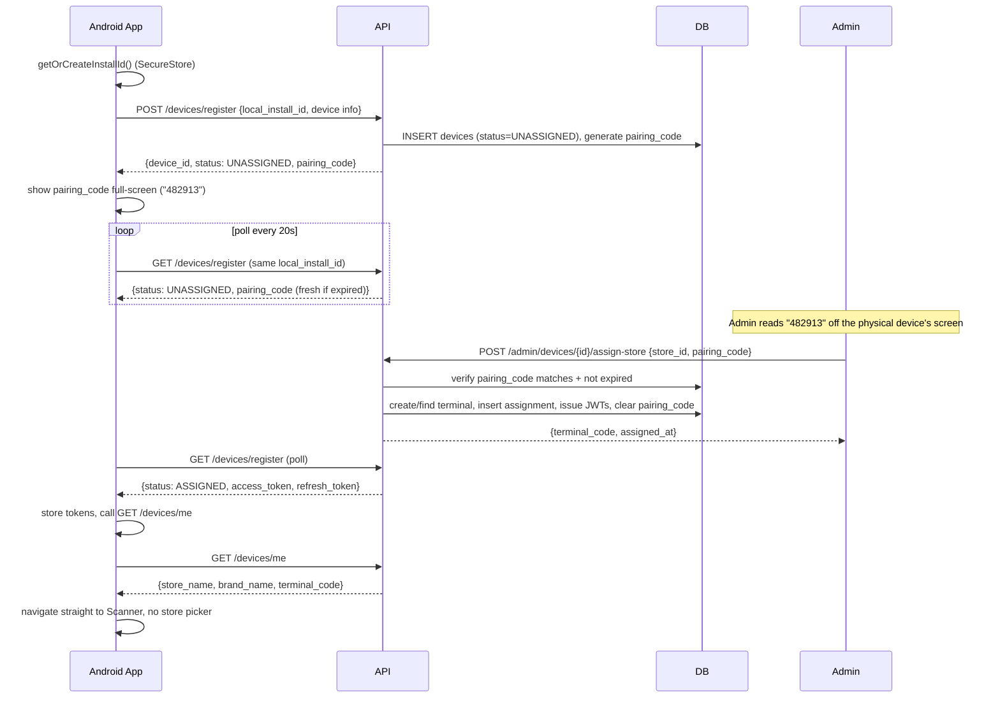
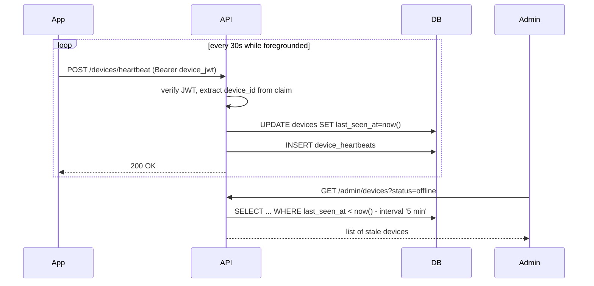

# Terminal Provisioning & Store Assignment — Implementation Plan

## 0. Read This First — What Already Exists

Before designing anything new: **this repo already has ~70% of what you're asking
for**, built for Raspberry Pi devices. Do not create a parallel `pos_terminals`
table — it would duplicate and conflict with what's already here.

Already built:

| Piece | File | Status |
|---|---|---|
| `brands`, `stores`, `terminals`, `devices`, `device_terminal_assignments`, `device_heartbeats`, `audit_logs` tables | `migrations/versions/20260612_0001_enterprise_foundation.py` | Applied via Alembic |
| `POST /api/v1/devices/register`, `/activate`, `/{id}/heartbeat`, `GET /{id}/config` | `backend/routers/devices.py` | Working, Pi-shaped |
| `POST /api/v1/admin/devices/{id}/assign`, `/revoke` | `backend/routers/admin_devices.py` | Working |
| Pydantic request/response contracts | `backend/schemas_enterprise.py` | Working |
| Audit logging helper | `backend/services/audit.py` | Working |
| Full target architecture writeup (identity, schema, JWT claims, MQTT topics, partitioning) | `docs/enterprise-iot-architecture.md` | Design doc, Pi/mTLS-focused |

The existing design's **hierarchy is correct and should be kept**:

```text
Brand -> Store -> Terminal (logical checkout slot) -> Device (physical hardware)
                              ^
                device_terminal_assignments (temporal history)
```

This is exactly what Square Terminal / Toast POS do, and it's why your
"replace a dead Raspberry Pi" requirement (item 12) is *already* solvable
with the existing tables: revoke the old device's assignment, assign a new
device to the same `terminal_id`, and the terminal (and its order history)
never moves.

## 1. What's Actually Broken or Missing

This is the gap between what exists and what you need for Android phones/tablets:

1. **`POST /devices/register` assumes a Raspberry Pi with a certificate.**
   `csr_pem` is a required field (`backend/schemas_enterprise.py:9-13`,
   min length 32). A phone/tablet app has no CSR to send. This endpoint
   needs an Android-shaped sibling.

2. **Auth is not real yet — this is your biggest risk given "prevent
   spoofing" is a stated requirement.** Look at `backend/auth.py:24-54`:
   `require_device` and `require_admin` accept **any** bearer token and any
   `X-Device-Id` / `X-Admin-Id` header at face value. There is no signature
   check, no expiry check, and critically: **the device ID in the URL path
   is never verified against the token**. Right now, if you know any UUID
   in the `devices` table, you can call `/devices/{that_uuid}/heartbeat` or
   `/config` with literally any bearer string. This must be fixed before
   this system touches real stores.

3. **No admin identity system.** `require_admin` defaults `X-Admin-Id` to
   all-zeros if not supplied. There's no `admin_users` table, no login
   endpoint, no password hashing, no RBAC. `docs/production-implementation.md`
   already flags "Admin users/RBAC tables" as required-before-production.
   You said you'll build the dashboard UI later — but the *auth backend*
   for it needs to exist now, or "only admins can assign stores" is
   unenforceable.

4. **No listing endpoints.** Only `assign` and `revoke` exist. There is no
   "list unassigned devices," "list by store," or "list offline devices" —
   which is items 5 and 11 of your requirements.

5. **No store-level assign convenience.** The existing `assign` endpoint
   takes a `terminal_id`, not a `store_id` — because a store can have many
   terminals. Your flow ("admin picks a store from a popup") is simpler than
   that. Need a thin wrapper that auto-creates/reuses a terminal under the
   chosen store, or you accept exposing terminal selection to the admin.
   Recommendation below.

6. **No terminal-code auto-numbering** (`SC-000001`).

7. **No online/offline derivation** — `last_seen_at` exists on `devices`
   but nothing computes "online" from it yet.

## 2. Key Design Decision — Answer Before Building

Your dashboard flow (item 6) says "admin picks a **store**," but the schema
assigns devices to **terminals**, and stores can have many terminals (checkout
lane 1, lane 2, ...). Two ways to reconcile this:

- **Option A (recommended to start): one terminal per store, auto-created.**
  When an admin assigns an unassigned device to a store for the first time,
  the backend auto-creates a terminal row for that store (code
  `{store.code}-T01`) if one doesn't exist, then assigns the device to it.
  Admin UI only ever shows "assign to store." Simple, matches your spec
  exactly, and doesn't block you from adding multi-terminal stores later
  (D-Mart with 5 billing counters) without a schema change.
- **Option B: expose terminals as first-class in the dashboard from day one.**
  More correct for large stores with multiple lanes, more UI work now.

Recommendation: **Option A now**, revisit when a single store needs more than
one active terminal (e.g., multiple checkout counters in one store).

### 2.1 How does the admin know *which* unassigned row is the phone in front of them?

This is the part the original spec glosses over ("admin clicks Assign Store,
popup shows all stores") and it matters the moment two devices look alike.
`device_name`/`manufacturer`/`model` are **not enough to disambiguate** — a
store that unboxes 10 identical tablets produces 10 rows that all say
"Samsung SM-A546E, registered 2 minutes ago." The admin cannot tell them
apart from the dashboard alone.

Solution: a **pairing code**, shown on the physical device, that the admin
must type to confirm assignment — not just click a row. This is exactly
what Chromecast setup, Square Terminal pairing, and Toast KDS pairing do,
and it doubles as an anti-spoofing control (section 5.3): assignment now
requires proof someone actually looked at that device's screen, not just
knowledge of a UUID.

No new column needed — `ekart_prod.devices` already has
`activation_code VARCHAR(8)` and `activation_code_expires_at`, added in the
original Pi migration and already used by the existing `/devices/activate`
route (`backend/routers/devices.py:65-110`). Reuse it, direction flipped:

- **Pi flow (existing)**: admin generates the code out-of-band, gives it to
  the device, device calls `/activate` with the code it was told.
- **Android flow (new)**: the *device* generates/receives the code at
  register time and displays it on-screen; the *admin* reads it off the
  screen and types it into the dashboard when assigning. See updated 4.1
  and 4.4 below.

This code is a short-lived pairing secret, not a login credential — 15
minute expiry, regenerable by the still-unassigned app if it expires while
waiting (pull-to-refresh on the pending screen re-requests a new code).

## 3. Database Changes

No new top-level tables needed for the core flow — the existing
`brands/stores/terminals/devices/device_terminal_assignments` shape already
satisfies your requirements 1, 2, 3, 12. Add columns and one new table for
admin identity.

### 3.1 `ekart_prod.devices` — add columns

| column | type | purpose |
|---|---|---|
| `device_type` | `VARCHAR(20)` default `'RASPBERRY_PI'` | Distinguishes `RASPBERRY_PI` (cert-based, existing flow) from `ANDROID_APP` (JWT-only, new flow). Governs which auth path applies. |
| `local_install_id` | `UUID` | The client-generated UUID the Android app persists (SecureStore-backed) on first launch. This is the "permanent Device UUID" from your Step 2 — it identifies the *app install*, not a certificate. |
| `manufacturer` | `VARCHAR(100)` | From `expo-device` (`Device.manufacturer`), e.g. "Samsung". |
| `os_version` | already exists | Reused; populated from `Device.osVersion`. |
| `device_name` | `VARCHAR(150)` | `Device.deviceName`, e.g. "Harsh's Galaxy A54" — human label for the dashboard list. |
| `platform` | `VARCHAR(20)` | `"android"` / `"ios"`. Kept even though target is Android-only today, since "future Android kiosks" and possibly iOS are in scope. |
| `refresh_token_hash` | `TEXT` | SHA-256 of the current valid refresh token (never store raw tokens). Enables revocation without an extra table. |
| `refresh_token_expires_at` | `TIMESTAMPTZ` | Refresh token TTL. |

`csr_pem` stays required only when `device_type = 'RASPBERRY_PI'`; enforce
that in the Pydantic schema (see 4.1), not the DB.

Add a unique index so the same phone can't silently register twice:

```sql
ALTER TABLE ekart_prod.devices
  ADD COLUMN device_type VARCHAR(20) NOT NULL DEFAULT 'RASPBERRY_PI',
  ADD COLUMN local_install_id UUID,
  ADD COLUMN manufacturer VARCHAR(100),
  ADD COLUMN device_name VARCHAR(150),
  ADD COLUMN platform VARCHAR(20),
  ADD COLUMN refresh_token_hash TEXT,
  ADD COLUMN refresh_token_expires_at TIMESTAMPTZ;

CREATE UNIQUE INDEX idx_devices_local_install_id
  ON ekart_prod.devices(local_install_id)
  WHERE local_install_id IS NOT NULL;
```

### 3.2 `ekart_prod.terminals` — add column

| column | type | purpose |
|---|---|---|
| `terminal_code` sequence | n/a | Auto-generate `SC-000001` style codes (see 3.4), replacing manually-chosen `terminal_code`. |
| `deactivated_at` | `TIMESTAMPTZ NULL` | Soft-disable a terminal itself (distinct from disabling the device attached to it) — needed for `POST /admin/deactivate-terminal`. |

```sql
ALTER TABLE ekart_prod.terminals
  ADD COLUMN deactivated_at TIMESTAMPTZ;
```

### 3.3 New table: `ekart_prod.admin_users`

Minimal, but real — password hash + role, so "only administrators can
assign stores" is actually enforced, not just documented.

```sql
CREATE TABLE ekart_prod.admin_users (
    admin_id UUID PRIMARY KEY DEFAULT gen_random_uuid(),
    email VARCHAR(200) UNIQUE NOT NULL,
    password_hash TEXT NOT NULL,
    full_name VARCHAR(200),
    role VARCHAR(30) NOT NULL DEFAULT 'STORE_ADMIN',
    brand_id UUID REFERENCES ekart_prod.brands(brand_id),
    is_active BOOLEAN DEFAULT TRUE,
    last_login_at TIMESTAMPTZ,
    created_at TIMESTAMPTZ DEFAULT NOW()
);
```

- `role`: `SUPER_ADMIN` (all brands) or `STORE_ADMIN` (scoped to `brand_id`).
  Keeps multi-brand isolation consistent with `docs/multi-brand-plan.md`.
- Seed one `SUPER_ADMIN` row manually (or a one-off script) — no self-signup.

### 3.4 Terminal code auto-numbering

Use a Postgres sequence so codes are gap-free-ish and race-safe without
locking the whole table:

```sql
CREATE SEQUENCE IF NOT EXISTS ekart_prod.terminal_code_seq START 1;
```

Service layer generates `f"SC-{nextval:06d}"` when auto-creating a terminal
(see 4.4). A sequence, not `COUNT(*) + 1`, avoids duplicate codes under
concurrent assignment requests.

## 4. Backend API Design

All new/changed endpoints follow the existing conventions: `ok()`/`fail()`
envelope (`backend/api_response.py`), `ErrorCode` enum, `write_audit_log`
for every state change.

### 4.1 `POST /api/v1/devices/register` — extend for Android

Add a `device_type` discriminator. Keep the existing Pi/CSR path working.

Request (Android):

```json
{
  "device_type": "ANDROID_APP",
  "local_install_id": "3f9a2b10-...-uuid",
  "device_name": "Harsh's Galaxy A54",
  "manufacturer": "samsung",
  "model": "SM-A546E",
  "os_version": "14",
  "app_version": "1.4.0",
  "platform": "android"
}
```

Response:

```json
{
  "success": true,
  "data": {
    "device_id": "b7e1...-uuid",
    "terminal_code": null,
    "status": "UNASSIGNED",
    "access_token": null,
    "pairing_code": "482913",
    "pairing_code_expires_at": "2026-07-04T10:15:00Z",
    "message": "Registered. Show this code to your admin to assign a store."
  }
}
```

The app renders `pairing_code` full-screen (large digits) on the pending
screen — this is the string the admin types into 4.4. If the device polls
this same endpoint again after `pairing_code_expires_at`, generate and
return a fresh code (see 6.2).

Behavior:

- Look up by `local_install_id` first (idempotent — reinstalling the app
  without clearing storage should not create a duplicate row). If found,
  return its current state instead of erroring — this is your "prevent
  duplicate registrations" requirement (item 10). If it's still
  `UNASSIGNED` and the existing code expired, issue a new one and return
  it rather than erroring.
- If not found, insert a new `devices` row with `store_id`-equivalent
  (via `device_terminal_assignments`) left empty, `status = 'UNASSIGNED'`.
- Do **not** issue a device JWT yet — a device with no store assignment has
  nothing to authenticate for except polling its own status. Issue the JWT
  only after assignment (see 4.3), matching the existing Pi
  `register` (unauthenticated) → `activate` (authenticated) split.

### 4.2 `POST /api/v1/devices/heartbeat` — reuse existing, fix auth

Existing route: `POST /api/v1/devices/{device_id}/heartbeat`
(`backend/routers/devices.py:113`). Keep the route, but:

- Change auth so `device_id` comes from the **verified JWT claim**, not
  trusted from the URL. Add a check: `if str(principal.device_id) !=
  str(device_id): raise 403`. This closes the spoofing hole in section 1.2.
- Before a device is assigned, it has no JWT — allow **unauthenticated**
  heartbeats keyed by `local_install_id` for unassigned devices only
  (so the admin dashboard can show "last seen 2 min ago" even for devices
  waiting on assignment), but never let an unauthenticated heartbeat touch
  an *assigned* device's row.

### 4.3 `GET /api/v1/devices/me` — new, replaces trusting `GET /{device_id}/config`

This is your `GET /terminal/me`. Difference from the existing
`GET /devices/{device_id}/config`: identity comes from the JWT, not a path
parameter, so a device can never query another device's config.

```http
GET /api/v1/devices/me
Authorization: Bearer <device_jwt>
```

```json
{
  "success": true,
  "data": {
    "device_id": "b7e1...",
    "terminal_id": "8a21...",
    "terminal_code": "SC-000001",
    "store_id": "c901...",
    "store_name": "D-Mart Andheri",
    "brand_id": "aa10...",
    "brand_name": "D-Mart",
    "status": "ASSIGNED",
    "config_version": 3
  }
}
```

If the device has no active assignment, return `success: true` with
`status: "UNASSIGNED"` and null store fields — the app uses this to decide
"show waiting-for-assignment screen" vs "go straight to scanner."

### 4.4 `POST /api/v1/admin/devices/{device_id}/assign-store` — new convenience wrapper

Implements Option A from section 2. Requires `require_admin`.

Request — `pairing_code` is the number the admin read off the physical
device's pending screen (section 2.1), not something the admin makes up:

```json
{ "store_id": "c901...-uuid", "pairing_code": "482913", "notes": "Front counter" }
```

Server logic:

1. Verify admin's `role`/`brand_id` covers this store (RBAC check).
2. Load the device by `device_id`; reject with `403 FORBIDDEN` if
   `pairing_code` doesn't match or `pairing_code_expires_at` has passed
   (tell the admin to ask for a fresh code — the app regenerates one on
   pull-to-refresh per 4.1). This is the step that actually ties the
   dashboard row to the physical unit.
3. `SELECT terminal_id FROM terminals WHERE store_id = :store_id AND deactivated_at IS NULL ORDER BY created_at LIMIT 1 FOR UPDATE`.
4. If none exists, generate the next `terminal_code_seq` value, insert a new
   terminal row for that store.
5. Call the same logic as today's `assign_device` (`admin_devices.py:17`):
   revoke any existing active assignment for this device, revoke any
   existing active assignment for the target terminal (a terminal always
   has at most one live device — already enforced by the partial unique
   index `idx_dta_unique_active_terminal`), insert new assignment row.
6. Issue the device's first JWT access+refresh token pair, store
   `refresh_token_hash` on the device row, and clear `pairing_code` (it's
   single-use — a consumed code must not work for a second assignment).
7. Write `DEVICE_ASSIGNED` audit log (pattern already used).

Response mirrors 4.3's shape plus the tokens the device should now store:

```json
{
  "success": true,
  "data": {
    "assignment_id": "e410...",
    "terminal_id": "8a21...",
    "terminal_code": "SC-000001",
    "access_token": "eyJ...",
    "refresh_token": "eyJ...",
    "expires_in": 900
  }
}
```

### 4.5 `POST /api/v1/admin/devices/{device_id}/change-store`

Same handler as 4.4 — reassigning to a different store is just calling
`assign-store` again (it already revokes the previous assignment). Keep it
as one endpoint internally; expose `change-store` as an alias in the API
doc if you want the semantic distinction for the dashboard, but don't
duplicate logic.

### 4.6 `POST /api/v1/admin/devices/{device_id}/deactivate`

Wraps the existing `revoke` (`admin_devices.py:91`) plus sets
`devices.status = 'DISABLED'` (a new terminal status, not reusing
`PROVISIONED`, so "disabled by admin" is distinguishable from "never
assigned"). Also immediately invalidates the device's refresh token
(`refresh_token_hash = NULL`) so a revoked device can't silently refresh
its way back to a valid session — this is part of "prevent spoofing."

### 4.7 New admin listing endpoints

None of these exist today; needed for Step 5/11 of your spec.

```text
GET /api/v1/admin/devices?status=unassigned
GET /api/v1/admin/devices?status=assigned
GET /api/v1/admin/devices?status=offline
GET /api/v1/admin/devices?status=disabled
GET /api/v1/admin/devices/{device_id}          # detail + assignment history
```

Response item shape:

```json
{
  "device_id": "b7e1...",
  "device_name": "Harsh's Galaxy A54",
  "manufacturer": "samsung",
  "model": "SM-A546E",
  "os_version": "14",
  "app_version": "1.4.0",
  "status": "ASSIGNED",
  "terminal_code": "SC-000001",
  "store_name": "D-Mart Andheri",
  "last_seen_at": "2026-07-03T09:58:00Z",
  "is_online": true,
  "registered_at": "2026-06-20T11:00:00Z"
}
```

Deliberately **do not** include `pairing_code` in this list response. If the
dashboard showed the code, an admin could assign a device without ever
looking at its screen, which defeats the point of section 2.1 — the code
must only ever be readable from the physical device itself.

`is_online` is computed, not stored:
`last_seen_at > now() - interval '90 seconds'` (see 4.8 for the interval
choice), evaluated in the query with a `CASE` expression — no extra column
needed, avoids the value going stale.

### 4.8 Heartbeat cadence and online/offline thresholds

- App sends a heartbeat every **30 seconds** while foregrounded (matches
  the interval already assumed in `docs/enterprise-iot-architecture.md`).
- `online`: `last_seen_at` within last 90s (3 missed intervals tolerance
  for normal network jitter).
- `offline`: no heartbeat for 5+ minutes.
- Don't build a separate background scheduler for this — compute it
  on-read in the admin listing query. At 10,000 terminals this is a cheap
  indexed range scan, not worth a cron job until proven otherwise.

## 5. Authentication Design

### 5.1 Device JWT

Add `pyjwt` to `requirements.txt` (not currently a dependency — checked).

Claims (adapted from `docs/enterprise-iot-architecture.md` section 7, but
dropping the mTLS-specific `cert_fp` field for the Android path):

```json
{
  "iss": "smart-ekart",
  "sub": "device:b7e1...-uuid",
  "device_id": "b7e1...-uuid",
  "device_type": "ANDROID_APP",
  "scope": ["device:heartbeat", "device:me", "device:orders"],
  "iat": 1781200000,
  "exp": 1781200900
}
```

- Access token TTL: 15 minutes. Refresh token TTL: 30 days, rotated on
  every use (issue a new refresh token each time, invalidate the old hash).
- `require_device` (`backend/auth.py:24`) must be rewritten to actually
  decode and verify the JWT signature, check `exp`, and set
  `DevicePrincipal.device_id` from the verified claim — not from a
  client-supplied header. Every route that currently reads `device_id`
  from the URL path must be changed to compare it against
  `principal.device_id` and reject mismatches (section 1.2 fix).

### 5.2 Admin JWT

Add a real login endpoint:

```http
POST /api/v1/admin/auth/login
{ "email": "admin@dmart.example", "password": "..." }
```

```json
{ "access_token": "eyJ...", "expires_in": 3600, "role": "SUPER_ADMIN" }
```

- Passwords hashed with `bcrypt` (add `passlib[bcrypt]` to requirements).
- `require_admin` (`backend/auth.py:44`) decodes the JWT, loads
  `AdminPrincipal(admin_id, role, brand_id)` from claims — no more
  defaulting to an all-zero UUID.
- Since there's no dashboard UI yet, this endpoint plus the assign/list
  endpoints are enough to test the whole flow with `curl`/Postman until the
  UI exists.

### 5.3 Preventing the three named attacks

| Requirement | Mechanism |
|---|---|
| Prevent users from changing stores | Only `require_admin`-guarded routes can call assign/change-store/deactivate. The Android app never gets an endpoint that accepts a `store_id` from the device itself. |
| Prevent spoofing another device | Device JWT is signed server-side; every device-scoped route compares the URL/body `device_id` against the JWT's verified claim (section 4.2/5.1) instead of trusting the caller. |
| Prevent duplicate registrations | `local_install_id` unique index (3.1) + register-is-idempotent lookup (4.1) — re-registering an existing install returns its existing state instead of creating a new row. |

## 6. React Native (Frontend) Changes

### 6.1 Device identity generation

On first launch, generate and persist a UUID — this is `local_install_id`.
Use `expo-secure-store` (Keystore-backed on Android) so it survives app
updates and isn't trivially readable by other apps:

```text
frontend/services/deviceIdentity.js
  getOrCreateInstallId() -> reads/writes SecureStore key "sc_install_id"
  collectDeviceInfo()    -> expo-device: manufacturer, model, osVersion,
                             deviceName; expo-application: applicationVersion
```

Add `expo-device` and `expo-secure-store` to `frontend/package.json` (not
currently present — confirm during implementation).

### 6.2 Boot sequence — replaces `LOCKED_STORE_ID` and the store picker

Today's flow (`frontend/screens/HomeScreen.js:15,58-66`) uses a **build-time**
env var to lock a store, or shows every store if unset. Replace with a
**runtime, server-driven** flow:

```text
App boot
  -> getOrCreateInstallId()
  -> have cached access_token + terminal config in SecureStore/AsyncStorage?
       yes -> optimistically show scanner with cached store name,
              call GET /devices/me in background to revalidate
       no  -> POST /devices/register (local_install_id + device info)
              -> status UNASSIGNED?
                   yes -> show "Waiting for admin to assign this device
                          to a store" screen with pairing_code in large
                          text (section 2.1), poll register every 15-30s
                          (also re-requests a fresh code if expired)
                   no (already assigned, re-registration case)
                       -> fall through to GET /devices/me
```

Once assigned (admin reads the on-screen code, calls `assign-store` with
it, device's next
poll/heartbeat picks up new tokens via a "pending assignment" flag,
or — simpler for v1 — the waiting screen itself polls
`GET /api/v1/devices/register` status until `ASSIGNED`, then stores the
returned tokens and calls `GET /devices/me`), the store picker UI in
`HomeScreen.js` is deleted entirely for provisioned devices. Customers never
see it — matching your hard requirement.

### 6.3 Files to change

- `frontend/services/api.js` — add `registerDevice()`, `getDeviceMe()`,
  `sendHeartbeat()`; attach `Authorization: Bearer <access_token>` from
  SecureStore to every request once assigned.
- `frontend/services/CartContext.js` (or a new `TerminalContext.js`) — hold
  `terminal`, `store`, `brand` from `GET /devices/me` instead of from user
  selection.
- `frontend/screens/HomeScreen.js` — becomes customer name/phone entry only;
  store is no longer a field here at all (not even hidden-and-locked — just
  gone, read from `TerminalContext`).
- New `frontend/screens/ProvisioningPendingScreen.js` — shown when
  `status === "UNASSIGNED"`. Displays `pairing_code` in large centered text
  (this is the whole point of the screen — it must be readable from across
  a counter), with a small "code expired, tap to refresh" fallback.
- Heartbeat: a `setInterval` (30s) while the app is foregrounded, paused on
  background (`AppState` listener) to avoid draining battery on idle
  kiosks/tablets.

### 6.4 Offline cache

- Cache the last successful `GET /devices/me` response and tokens in
  `expo-secure-store` (tokens) / `AsyncStorage` (non-sensitive config).
- On boot with no network: use cached config so the terminal doesn't get
  stuck on a spinner; still queue a background revalidation for when
  connectivity returns.
- If the cached config's `terminal_id` was revoked server-side while
  offline, the next successful `GET /devices/me` call returns
  `status: "UNASSIGNED"` again — app must detect this transition and drop
  back to the pending screen, clearing the stale cached store/brand. This
  is the one edge case worth a test: **do not let a de-provisioned device
  keep operating on stale cached credentials indefinitely** — cap how long
  a device is allowed to run purely on cache (e.g., require revalidation at
  least once every 24h).

## 7. Replacement Flow (Raspberry Pi / device dies)

Already achievable with existing tables + the new endpoints, no schema
change needed:

```text
1. Old device (terminal SC-000001) stops sending heartbeats.
2. Admin dashboard shows it under "Offline Devices" after 5 min silence.
3. Admin installs the app on a new phone/Pi.
4. New device calls POST /devices/register -> gets its own device_id,
   status UNASSIGNED (this is a brand new local_install_id, so it does
   NOT collide with the dead device's row).
5. Admin opens dashboard, sees new device in "Unassigned" — since it's the
   only new one, or the admin is standing at the counter and reads the
   pairing code off its screen either way (section 2.1) — picks the SAME
   store ("D-Mart Andheri") and enters that code. assign-store (4.4) finds
   the existing terminal (SC-000001) for that store and reassigns it:
     - revokes old device's assignment to SC-000001 (old device now shows
       "Unassigned/Revoked" if it ever comes back online)
     - creates new assignment: SC-000001 -> new device_id
6. Order history under SC-000001 is untouched — orders reference
   terminal_id, not device_id, as the durable "this till" identity.
7. Admin calls deactivate (4.6) on the old device_id to be explicit that
   it's retired, not just unassigned.
```

## 8. Sequence Diagrams

### 8.1 First registration -> pending -> assigned



### 8.2 Heartbeat + online status



## 9. Scalability Notes (10,000+ terminals / 1,000+ stores)

Nothing above requires a different architecture at that scale, because it's
inheriting the partitioning strategy already documented in
`docs/enterprise-iot-architecture.md` (section "Partitioning"):

- `device_heartbeats` and `audit_logs` are already designed to be
  partitioned by time — keep that when you implement, don't let heartbeat
  writes hit an unpartitioned table at 10k devices × 1 heartbeat/30s
  (~333 writes/sec sustained).
- Admin listing queries (4.7) filter on indexed columns
  (`status`, `last_seen_at`) — add
  `CREATE INDEX idx_devices_status ON devices(status)` (already present per
  migration) and confirm `last_seen_at` gets an index once heartbeat volume
  is real.
- Keep FastAPI stateless (already true) so it scales horizontally behind a
  load balancer with no code change.
- Nothing here needs sharding at this scale — partitioning + read replicas
  (already documented) is enough per the existing architecture doc.

## 10. Build Order

1. **Migration**: columns from section 3 (`device_type`, `local_install_id`,
   admin_users table, terminal_code_seq, terminals.deactivated_at).
2. **Auth fix first, before anything else ships**: real JWT verification in
   `backend/auth.py`, closing the device_id-spoofing hole (section 1.2) —
   this is a pre-existing vulnerability in code that's already deployed,
   independent of the new Android flow.
3. **Admin login + `admin_users`** (section 5.2) — required before any
   assign endpoint can honestly claim "only admins can do this."
4. **Android register/me/heartbeat endpoints** (4.1–4.3).
5. **Admin assign-store/change-store/deactivate/list endpoints** (4.4–4.7).
6. **Frontend**: device identity + boot sequence + delete store picker
   (section 6).
7. **Replacement flow test**: manually walk through section 7 end-to-end
   with two physical/emulated devices against one store.
8. Admin dashboard **UI** — deferred, per your note; the API surface above
   is designed so the UI is a pure consumer with no new backend logic
   needed when you build it.

## Out of Scope For Now

- mTLS / certificate-based identity — that's the Raspberry Pi path that
  already exists; Android phones use JWT-only auth per section 5.
- MQTT push-to-device (config changes, remote disable) — heartbeats +
  polling `GET /devices/me` are sufficient until push is actually needed.
- Full RBAC permission matrix beyond `SUPER_ADMIN`/`STORE_ADMIN` — add more
  roles when the dashboard actually needs them.
